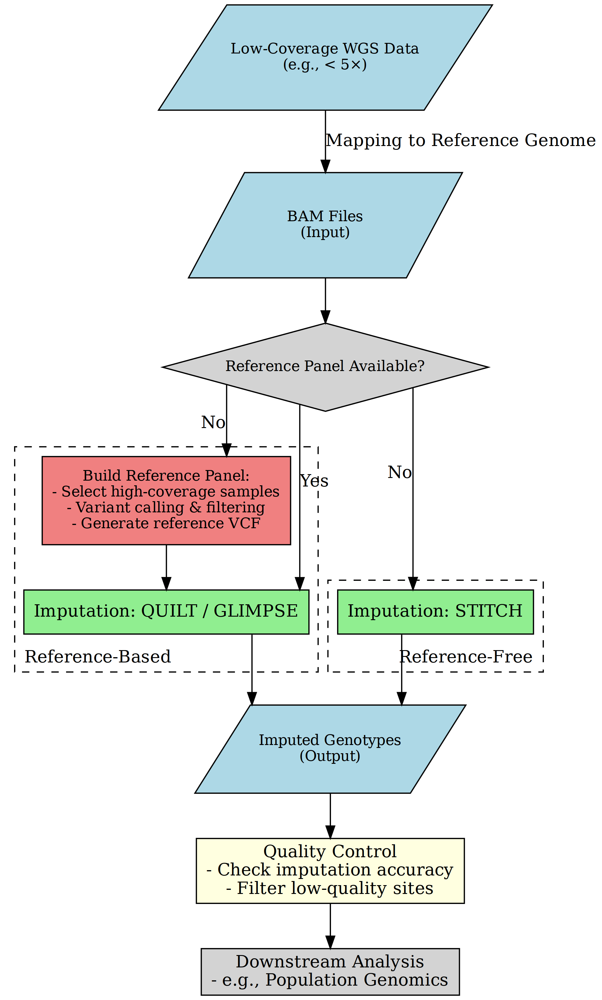
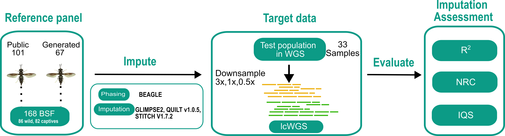

# BSF-Reference-Panel
Establishing a Reference Genome Panel and Evaluating Imputation Strategies for Low-Coverage Sequencing in Black Soldier Fly (Hermetia illucens)

## Low-coverage WGS (lcWGS) imputation pipeline

## Study design

## Imputation tools
1. [GLIMPSE2](https://odelaneau.github.io/GLIMPSE/) - [Read more](https://www.nature.com/articles/s41588-023-01438-3)
2. [QUILT](https://github.com/rwdavies/QUILT) - [Read more](https://www.nature.com/articles/s41588-021-00877-0)
3. [STITCH](https://github.com/rwdavies/STITCH) - [Read more](https://www.nature.com/articles/ng.3594)

## Imputation Accuracy
1. [VcfPPR](https://github.com/Zilong-Li/vcfppR) - [Read more](https://academic.oup.com/bioinformatics/article/40/2/btae049/7589925)